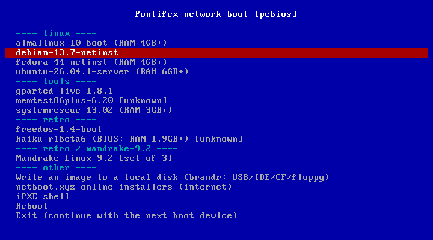
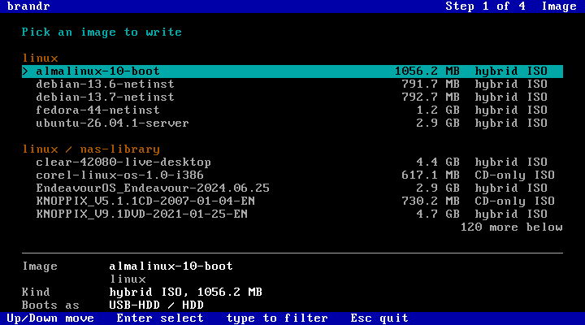

# Pontifex

**A network boot server for home labs and retro PCs.** Drop symlinks to your ISOs and floppy
images into a folder, and any machine on your LAN can PXE boot them from a menu: modern UEFI
PCs, old BIOS boxes, and 1990s machines with an ISA network card and a boot floppy. Pontifex
works out how to boot each image by looking inside it.

It also comes with **brandr**, a disk writer you netboot. It streams any image from the
server onto a USB stick, IDE disk, CF card or real floppy of the machine it runs on, so you can
make boot media on hardware your modern PC doesn't have.

<p align="center">
  
  
</p>

## What it does
- **One folder of symlinks is the whole library.** `ln -s /nas/isos/debian.iso library/linux/`
  and it's in the menu on the next boot. Folders become menu sections, and folder symlinks work
  too, so an existing ISO collection can be linked in once.
- **Auto-detected boot recipes.** Debian and Ubuntu installers, Fedora/Alma/Rocky (Anaconda),
  Arch/EndeavourOS/SystemRescue (archiso), Debian live (GParted, Clonezilla), Fedora live,
  Puppy, Knoppix, antiX/MX, Clear Linux, the VMware ESXi installer, WinPE and Windows setup
  (wimboot), Mandrake, Red Hat and Fedora Core installers, floppy images (memdisk), and a
  generic CD-emulation fallback for everything else. Entries show the
  RAM they need, and images no recipe recognized are tagged `[unknown]`.
- **BIOS, UEFI and retro.** Boot from a NIC's PXE ROM, or from an iPXE floppy for cards
  without one. NE2000 and 3c509 ISA floppies are built too.
- **No changes to your router.** Pontifex answers PXE clients itself (proxyDHCP), while your
  router keeps handing out addresses.
- **brandr, the disk writer**, runs on a Pentium with 256 MB of RAM. It writes raw images,
  floppy sets ("insert disk 2 of 6"), floppy images as **USB-HDD** or **USB-ZIP** disks for
  old BIOSes, and **UEFI sticks** from CD-only ISOs, Windows included (install.wim split
  for FAT32, boots on UEFI and BIOS). Streams recover from network hiccups.

## How it works
```
PC ── DHCP ──> your router: IP address           (unchanged)
         └───> Pontifex dnsmasq (proxyDHCP): "boot iPXE from me" (BIOS or UEFI flavour)
PC ── TFTP ──> iPXE (100 KB)
iPXE ─ HTTP ─> menu service: a menu built from library/ on every request
iPXE ─ HTTP ─> kernel/initrd, wimboot, memdisk or the ISO itself (nginx, Range requests)
```

## Quick start
Requirements: a Linux server on the LAN with Docker (compose v2), `curl` and `git`.
```sh
git clone --recursive https://github.com/chibicitiberiu/pontifex.git
cd pontifex
./setup.sh          # asks for IP, interface, data dir, ISO folders (defaults detected)
```
Then open the firewall for UDP 67, 69, 4011 and your HTTP port (setup prints the commands),
link some images into `<data dir>/library/<section>/`, and PXE boot a machine. Secure Boot must
be off on UEFI machines. **[docs/SETUP.md](docs/SETUP.md)** has the details, including retro
machines and troubleshooting.

## Documentation
| | |
|---|---|
| [docs/SETUP.md](docs/SETUP.md) | installation, settings, firewall, DHCP, retro machines, UEFI, troubleshooting |
| [docs/IMAGES.md](docs/IMAGES.md) | the library, how images are detected and booted, sets, per-image options, limits |
| [docs/WRITER.md](docs/WRITER.md) | brandr: screens, write methods, BIOS USB modes, NICs, floppies |
| [docs/DEVELOPING.md](docs/DEVELOPING.md) | repository layout, building the pieces, testing with QEMU |

## Credits
brandr is a fork of [caligula](https://github.com/ifd3f/caligula) by Astrid Yu, whose engine
does the writing and verifying. Pontifex builds on [iPXE](https://ipxe.org),
[dnsmasq](https://thekelleys.org.uk/dnsmasq/doc.html), [nginx](https://nginx.org),
[Tiny Core Linux](http://tinycorelinux.net), [syslinux/memdisk](https://wiki.syslinux.org),
[wimboot](https://ipxe.org/wimboot) and [wimlib](https://wimlib.net). They're downloaded or
built from their official sources during setup, not redistributed here.

## License
GPL-3.0. See [LICENSE](LICENSE).
