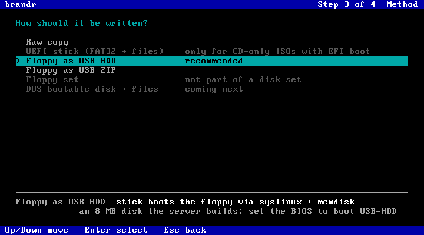

# The disk writer (brandr)

Pick **"Write an image to a local disk (brandr)"** in the Pontifex menu. The machine boots a
small Tiny Core Linux with [brandr](https://github.com/chibicitiberiu/brandr), a fork of the
caligula disk imager. brandr streams any image from the library onto a local disk of that
machine: a USB stick, IDE/SATA/NVMe disk, CF card or real floppy. The image is streamed, never
loaded into RAM, so a Pentium with 256 MB can write a 5 GB Windows stick.

It's handy for the machines themselves (write a CF card on the retro box that will use it) and
for hardware your modern PC lacks, like IDE ports and floppy drives.

## The four steps
Esc always goes back one step.

  
  
  
  

1. **Image:** the whole library grouped like the boot menu, with size and kind (`hybrid ISO`,
   `disk image`, `floppy image`, `CD-only ISO`). Type to filter. Multi-floppy sets are one
   entry.
2. **Target:** whole disks with size, bus (USB, ATA, NVMe, SD/MMC, floppy) and model. Disks
   too small are greyed out. *Partition a disk...* opens `cfdisk` and comes back; *Refresh*
   rescans after you plug in a stick.
3. **Method:** how to write it, with a *recommended* default from the image and target.
4. **Review:** what will be written where, how to boot the result, and the erase warning. The
   focus starts on **Back**: writing takes a deliberate move to **Write**.

Then the progress screen (speed, ETA, verify), and a small menu: write another image, shell,
reboot, power off.

## Write methods
| Method | What it does | Boot the result as | Recommended for |
|---|---|---|---|
| Raw copy | byte-for-byte copy, then read-back verify | hybrid ISO/disk image: USB-HDD or HDD. Floppy image on a stick: USB-FDD. On a floppy: floppy | ISOs and disk images; a floppy to a floppy drive |
| Floppy as USB-HDD | an 8 MB disk with syslinux + memdisk + the floppy image (memdisk boots it as A:) | USB-HDD | a floppy image to a stick or disk |
| Floppy as USB-ZIP | the same in ZIP-drive layout (partition 4, 64 heads / 32 sectors) | USB-ZIP | 2000-era BIOSes that only boot ZIP |
| Floppy set | every disk of a set in turn, with an "insert the next floppy" screen in between | floppy | a set, to a floppy drive |
| UEFI stick (FAT32 + files) | the files of a CD-only ISO on FAT32; Windows' install.wim split if over 4 GB, plus a BIOS boot path | UEFI (Windows: also USB-HDD on BIOS) | a CD-only ISO that has EFI boot |

The USB-HDD/ZIP and UEFI layouts are built by the server (see [IMAGES.md](IMAGES.md#layouts-the-server-builds-for-the-disk-writer)).
The first UEFI stick for an ISO shows a "Preparing the image" screen while the server builds
it. **USB-CD** mode can't be produced on an ordinary stick: it needs hardware that reports
itself as a CD drive.

## Old-BIOS USB boot modes, in short
| BIOS mode | What it expects on the stick |
|---|---|
| USB-HDD | MBR boot code and an active partition: hybrid ISOs, disk images, the USB-HDD method |
| USB-FDD | a floppy boot sector at sector 0: a raw floppy image |
| USB-ZIP | ZIP-drive geometry, partition 4: the USB-ZIP method |
| USB-CD | a device that reports itself as a CD drive: not possible on a normal stick |

## Networking
- **RTL8139 and PCI NE2000 clones** work out of the box, as do most PCI and onboard cards
  Tiny Core has drivers for.
- **ISA NE2000** is probed at 0x300, 0x280, 0x320, 0x340, 0x240 and 0x360. For another port,
  boot with `pontifex.ne=<io>[,<irq>]`.
- If no card comes up, the writer says so and offers retry, shell, reboot or power off.
- Network hiccups don't break a write: dropped or stalled connections (30 s) and server
  errors reconnect at the exact byte, backing off up to 15 s, 8 tries per incident.

## Floppies
- After a floppy swap, Linux fails the first access to the drive. The writer reads it until
  the new disk is recognised, and says so if a disk is missing or unformatted (Retry / Stop).
- Floppies are slow (~130 KB/s) and fail often, so every write is verified by reading back.

## UEFI and Secure Boot
- On UEFI machines the menu boots the 64-bit writer automatically.
- Netbooting needs Secure Boot **off**. The sticks it makes are a separate matter: a Windows
  stick boots with Secure Boot on.

## Speeds to expect
The slowest link decides. USB 1.1 ports (late-90s boards) manage about 1 MB/s, an ISA NE2000
0.5 to 1 MB/s, floppies ~130 KB/s. With USB 2.0 and 100 Mbit, expect ~10 MB/s; gigabit and
USB 3 reach 70 to 100 MB/s.

## Tested (in QEMU)
| Machine | NIC | Wrote | Result |
|---|---|---|---|
| Pentium (no SSE), 256 MB, BIOS | RTL8139 | memtest hybrid ISO to IDE | the disk boots memtest |
| Pentium, 256 MB, BIOS | NE2000 PCI | FreeDOS floppy to a floppy drive | the floppy boots FreeDOS |
| Pentium, 256 MB, BIOS | NE2000 ISA | (network via the port probe) | ok |
| 256 MB, BIOS | RTL8139 | Haiku anyboot (1.5 GB) to USB | the stick boots Haiku |
| 256 MB, BIOS | RTL8139 | MS-DOS 6.22 set, 3 floppies with swaps | all three identical to the images |
| 256 MB, BIOS | RTL8139 | FreeDOS as USB-HDD and as USB-ZIP | both boot FreeDOS |
| x86_64, UEFI | RTL8139 | Windows 11 as UEFI stick to NVMe (5.4 GB) | Windows Setup on UEFI, on BIOS, and with Secure Boot on |
| x86_64, UEFI | - | SystemRescueCd 5.3.2 as UEFI stick | boots to its shell |
